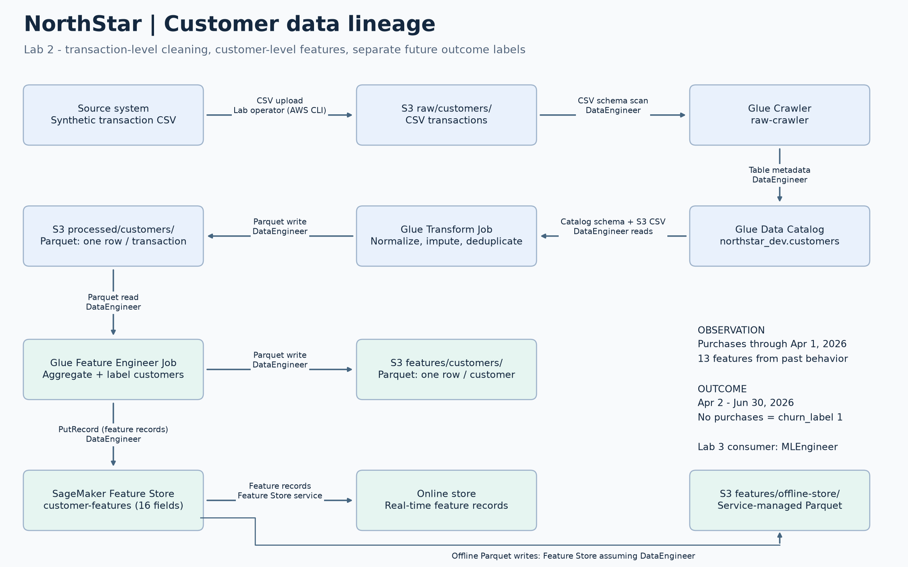

# NorthStar - CS 401R

Lab 1 provisions the platform foundation. Lab 2 adds private networking, data
engineering permissions, retention policies, and a reproducible customer-feature
pipeline for Lab 3 churn modeling.

## Architecture



Terraform lives in `infrastructure/`. Modules:

- `vpc`: public subnet, internet gateway, NAT gateway, private subnet and routes.
- `storage`: private encrypted versioned S3 data bucket and five lifecycle rules.
- `iam`: MLEngineer, DataEngineer, ModelMonitor and their scoped permissions.
- `sagemaker`: VPC-only Studio domain and MLEngineer profile in the private subnet.
- `glue`: catalog, raw crawler, private NETWORK connection, worker security group,
  uploaded scripts, and two Glue 4.0 Spark jobs (two G.1X workers each).
- `feature_store`: 16-field customer feature group with online and offline stores.

DataEngineer reads/writes raw, processed and features; it can only read job scripts
under artifacts/glue. ModelMonitor reads artifacts and publishes monitoring data;
it cannot write S3 or start processing jobs. MLEngineer retains Lab 1 permissions
and gains feature-record read access.

## Prerequisites

Terraform >= 1.5, AWS CLI authenticated to the lab account in us-east-1, Python
with boto3, pandas and pyarrow, and Git Bash/WSL for the supplied shell scripts.
Docker is needed for LocalStack only. Do not commit credentials, `.env`,
`*.tfvars`, Terraform state, or saved plans. The backend bucket and lock table
from Lab 1 must already exist; see `scripts/bootstrap-state.sh` for initial setup.

## Deploy

Run from the repository root:

```bash
terraform -chdir=infrastructure/environments/dev init
terraform fmt -check -recursive infrastructure
terraform -chdir=infrastructure/environments/dev validate
terraform -chdir=infrastructure/environments/dev plan -out=lab2.tfplan
terraform -chdir=infrastructure/environments/dev apply lab2.tfplan 2>&1 | tee docs/lab2-extend-output.txt
```

Review the plan first. If Lab 1 still runs, moving the domain can replace it.
The dev bucket enables force_destroy for regenerable synthetic data; deleting
the stack can delete every object version. The NAT gateway incurs ongoing cost.

## Run the pipeline

```bash
python scripts/run-lab2.py 2>&1 | tee docs/lab2-pipeline-output.txt
python scripts/verify-offline-lab2.py 2>&1 | tee docs/lab2-offline-verification.txt
```

The runner uploads the supplied CSV, starts and waits for the crawler, verifies
`northstar_dev.customers`, runs transform then feature-engineer, checks online
GetRecord, and waits for Feature Store offline Parquet delivery. Each stage fails
explicitly on errors or timeout. Do not launch overlapping pipeline runs: outputs
are overwritten in place. The runner supports `--project`, `--environment`, and
`--region` to match Terraform settings.
The offline verifier waits for every customer in the current snapshot and compares
all stored feature values against the feature-job output, not just file existence.

The transform trims fields, parses both date formats, imputes numeric medians and
unknown strings, and deterministically deduplicates transaction IDs. Quality gates
run before writing Parquet. See [the data contract](docs/lab2-data-contract.md).

Features use history through 2026-04-01; the churn label uses only purchases after
that cutoff through 2026-06-30. This is a temporal observation/outcome split, not
a train/test split. Customers without pre-cutoff history are excluded. Rolling
N-day windows are `(T - N days, T]`. The baseline risk score increases linearly
with recency in each band, with the high band saturating at 180 days.

The feature job writes `features/customers/`. Feature Store manages its separate
`features/offline-store/` prefix. Offline delivery is asynchronous; a successful
Glue run alone is insufficient proof that offline records have arrived.

## Validation

```bash
# Local Spark data tests (pyspark 3.5.x and Java 8/11/17)
python scripts/test-lab2-local.py

# Local infrastructure; NAT and lifecycle deliberately disabled
make local-validate LOCAL_OUT=docs/lab2-localstack-output.txt

# Actual deployed AWS resources and output data
export AWS_DEFAULT_REGION=us-east-1
bash scripts/verify-lab2.sh 2>&1 | tee docs/lab2-verify-output.txt
bash scripts/check-secrets.sh
```

Windows PowerShell users can run `./scripts/validate-local.ps1` instead of make.
It invokes the AWS CLI against localhost with temporary dummy credentials and
restores the caller's environment. Use PowerShell's `Tee-Object` for log capture.
Git Bash must resolve `python3` to a real Python installation with pandas/pyarrow,
not the Windows Store alias.
The supplied verifier has one portability fix: its Python tally file uses LF
line endings so Git Bash can read numeric counts on Windows. All checks are kept.

Local tests execute the production Spark functions without Glue-only imports.
They cover whitespace, nulls, both date formats, median imputation, deduplication,
cutoff boundaries, future leakage, empty recent history, loyalty thresholds and
the complete sample. AWS jobs provide validation on the actual Glue 4.0 runtime.

## Submission and teardown

Review the changes and verification evidence, commit, push the branch, then tag
the intended grading commit:

```bash
git tag lab2-submit
git push origin lab2-submit
```

Submit the existing repository URL in Canvas. After capturing evidence and
submitting, review and run `scripts/teardown-lab2.sh`, capturing its actual output
in `docs/lab2-destroy-output.txt`. The supplied script deletes synthetic data and
cleans up service-created resources outside Terraform; inspect its scope before
using it in an account shared with other projects. Do not delete the remote-state
backend. Commit teardown evidence as the guide requires; do not silently move an
already submitted tag.
